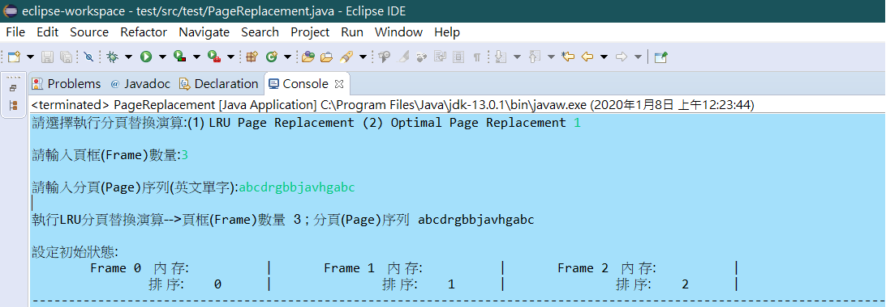
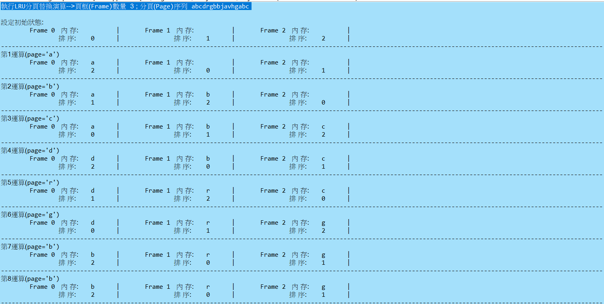
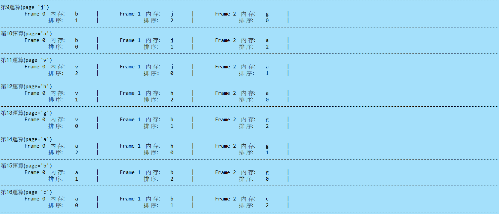

# PageReplacement
## 1. 說明
* 當使用分頁(Paging)管理記憶體時，如發生分頁錯誤(Page fault)，如何找到最佳替換分頁(Page)，取代新的內容，減少分頁發生錯誤機率為一門重要的研究課題，現今學術上亦已提出多種不同演算，以提升執行效率及降低錯誤率為目標。
* 本程式為實作LRU(Least Recently Used Page Replacement)及OPT(Optimal Page Replacement)兩種分頁替換演算。
* 開發及編譯工具 Eclipse
* 輸入方式:執行程式後，依系統畫面提示輸入相關變數，如下
    1.選擇本次執行分頁替換演算:(1) LRU Page Replacement (2) Optimal Page Replacement ==> 如輸入1，選擇LRU演算
    2.輸入頁框(Frame)數量 ==> 輸入本次執行Frame數量，如 3，代表產生3個Frame數量
    3.輸入分頁(Page)序列(英文單字) ==> 輸入連續存取分頁序列，以英文字母代表，如輸入"abcdrgbbjavhgabc"進行運算
    4.完成輸入後，按下Enter，系統產生「上述變數輸入確認」提示文字，隨即開始執行運算，畫面參考結果如下:     

## 2. 執行結果
* LRU Page Replacement : 以上例，設定3個 Frame，輸入16個分頁序列 (abcdrgbbjavhgabc)，執行結果如下   

 
* OPT Page Replacement : 以上例，設定3個 Frame，輸入16個分頁序列 (abcdrgbbjavhgabc)，執行結果如下   

## 3. 程式說明
 * 程式5~10行:設定一個Fram的類別，代表Frame，內含識別號(id)、下一個參考值位置(next)、內存(value)及是否為victim(replace)。
  <pre><code>class fram {
	int id;
	int next;
	char value;
	String replace;
}</code></pre>
 * 程式12~34行:為主程式，負責設定使用者提供之初始變數，如選擇替換演算法、頁框數量等，完成後將上述變數，如果選擇LRU演算，執行程式28行，如果選擇OPT演算，執行程式30行，否則跳出 "輸入錯誤，請重新執行程式 ! !" 提示。
<pre><code>public class PageReplacement {
	public static void main(String[] args) {
		// TODO Auto-generated method stub
		Scanner sc = new Scanner(System.in);
		System.out.print("請選擇執行分頁替換演算:(1) LRU Page Replacement (2) Optimal Page Replacement ");
		int choose = sc.nextInt();
		System.out.println();
		System.out.print("請輸入頁框(Frame)數量:");
		int NumofFrame = sc.nextInt();
		System.out.println();
		System.out.print("請輸入分頁(Page)序列(英文單字):");
		String Input = sc.next().toLowerCase();
		System.out.println();
		if (choose == 1)
			LRU_Algorithm(NumofFrame, Input);
		else if (choose == 2)
			Optimal_Algorithm(NumofFrame, Input);
		else
			System.out.println("輸入錯誤，請重新執行程式 ! !");
	}</code></pre>
 * Method I : LRU_Algorithm (36~91行) LRU演算
<pre><code>public static void LRU_Algorithm(int NumofFrm, String input)</code></pre>
	1.(38~44行):依使用者設定frame數量，初始化frame陣列
 <pre><code>int NumofInput = input.length();
		fram frm[] = new fram[NumofFrm];
		for (int i = 0; i < NumofFrm; i++) {
			frm[i] = new fram();
			frm[i].id = i;
			frm[i].value = ' ';
		}</code></pre>
2.(46~49行):將frame的ID，依Linkedlist的方式排列，保持最進換值的frame ID會在最後一個節點
<pre><code>LinkedList list = new LinkedList();
		for (int i = 0; i < NumofFrm; i++)
			list.add(i);</code></pre>
3.(60~71行):檢查目前輸入的序列的值，使否已存在任一frame中，如果是將此frame調至Linkedlist的最後一個節點，表示最近最新剛使用過
<pre><code>for (int i = 0; i < NumofInput; i++) {
			boolean error = true;
			for (int j = 0; j < NumofFrm; j++) {
				if (input.charAt(i) == frm[j].value) {
					int index = list.indexOf(frm[j].id);
					list.remove(index);
					list.addLast(frm[j].id);
					error = false;
					break;
				}
			}</code></pre>
4.(73~77行):表示目前輸入的序列的值，不存在任一frame中，目前Linkedlist狀態的第一個節點，即最久未使用過的frame，將此內存進行替換，完成後，再將此frame調至Linkedlist狀態的最後一個節點，表示剛替換過，為最近最新使用
<pre><code>if (error) {
			frm[(int) list.getFirst()].value = input.charAt(i);
			list.addLast((int) list.getFirst());
			list.remove(0);
	}</code></pre>
